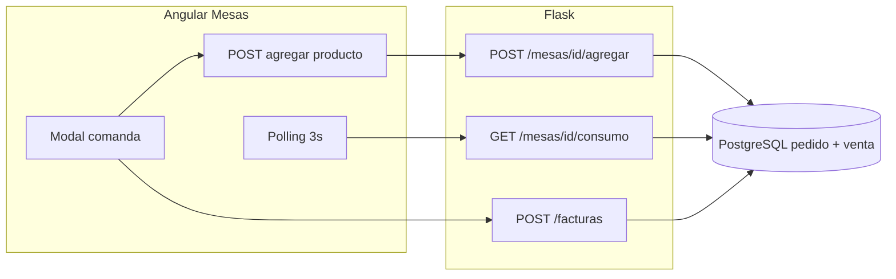

# Project Memory — Seasons Club App

> Memoria técnica del estado **estable y probado** del sistema POS interno. Versión de referencia: **1.1.0**.

---

## Resumen ejecutivo

Seasons Club App es un **POS interno** para operación de discoteca: mesas con comandas, facturación con IVA, inventario, cierre de caja por jornada, historial de ventas e impresión de reportes. El stack es **Angular 21 + Flask 3 + PostgreSQL**, con **autenticación JWT** y contraseñas **bcrypt**.

---

## Arquitectura final

### Capas

| Capa | Tecnología | Responsabilidad |
|------|------------|-----------------|
| Frontend | Angular 21 (standalone) | UI táctil, guards de rol, interceptores HTTP |
| Backend | Flask 3, SQLAlchemy | API REST bajo `/api`, lógica de negocio |
| Base de datos | PostgreSQL | Mesas, pedidos, ventas, cortes, usuarios, productos |
| Auth | PyJWT + `password_utils` (bcrypt) | Login, token 24h, hash uniforme en usuarios |

### Flujo de datos (mesas)

- **Comandas activas** persisten en servidor (`pedido` estado `pendiente`).
- **Polling cada 3 s** mientras el modal de mesa está abierto; `clearInterval` al cerrar.
- **Mutaciones** (agregar, cantidad, precio) usan POST al backend; el polling se pausa durante la petición para evitar condiciones de carrera.
- **Respaldo local:** `localStorage` (`mesa_consumo_{id}`) solo como fallback si falla la red.

### Autenticación y roles

| Rol | Acceso |
|-----|--------|
| **admin** | Mesas, inventario, historial de ventas, cierre de caja, control de usuarios |
| **mesero** | Solo `/mesas` (mapa y comandas) |

**Guards Angular:**

- `authGuard` — sesión JWT activa (`access_token` + usuario en `AuthService`).
- `adminGuard` — rol `admin`; si no es admin pero está logueado → redirige a `/mesas`.

**UI:** sidebar y menú del header solo visibles para admin. Rutas admin protegidas con `[authGuard, adminGuard]`.

**API usuarios** (`/api/usuarios`): CRUD protegido con JWT; solo admin. Contraseñas siempre con `hash_password()` (bcrypt).

### Rutas frontend principales

| Ruta | Componente | Guard |
|------|------------|-------|
| `/login` | Login | Público |
| `/mesas` | Mesas | authGuard |
| `/inventario` | Inventario | auth + admin |
| `/historial-ventas` | HistorialVentas | auth + admin |
| `/cierre-caja` | CierreCaja | auth + admin |
| `/usuarios` | Usuarios | auth + admin |

### Impresión

| Tipo | Mecanismo |
|------|-----------|
| Ticket de factura | Ventana emergente HTML + `window.print()` (mesas) |
| Historial de ventas / Cierre de caja | `ImpresionReporteUtil` + clase `body.modo-impresion-reporte` + `@media print` en `styles.css` |
| Contenedores | `.report-container`, `#main-content`, `.zona-reporte-impresion` |

Los estilos de impresión ocultan explícitamente header, sidebar, botones y `.no-print`; el contenido del reporte se fuerza visible con reglas dedicadas (sin ocultar `body *` global en modo reporte).

### Jornada operativa (cierre de caja)

- La jornada se delimita por el **último** registro en `corte_caja`, no por medianoche.
- `GET /api/reporte/diario` — totales desde el último corte.
- `POST /api/reporte/cierre` — snapshot y fin de jornada.
- `GET /api/reporte/cierres` — historial de cierres previos (impresión y consulta).

### IVA (Colombia 19%)

`subtotal = total / 1.19`, `iva = total - subtotal` (precio de venta con IVA incluido).

---

## Archivos clave

| Área | Archivo |
|------|---------|
| App Flask | `backend/app.py` |
| Auth | `backend/auth.py`, `backend/password_utils.py` |
| Mesas / ventas | `backend/routes/mesa_routes.py` |
| Reportes | `backend/services/reporte_service.py` |
| Usuarios admin | `backend/routes/admin_routes.py` |
| Rutas + guards | `frontend/src/app/app.routes.ts`, `guards/auth.guard.ts`, `guards/admin.guard.ts` |
| Mesas + polling | `frontend/src/app/components/mesas/mesas.component.ts` |
| HTTP mesas | `frontend/src/app/services/mesa.service.ts` |
| Auth cliente | `frontend/src/app/services/auth.service.ts` |
| Impresión | `frontend/src/styles.css`, `utils/impresion-reporte.util.ts` |

---

## Credenciales de desarrollo (seed automático)

| Rol | Email | Contraseña |
|-----|-------|------------|
| Admin | `admin@seasonsclub.com` | `admin1` |
| Mesero | `mesero@seasonsclub.com` | `mesero1` |

---

## Configuración local

- Backend: `backend/config.py` o `DATABASE_URL` — PostgreSQL `seasons_club_db`.
- Frontend: `frontend/src/environments/environment.ts` — `apiUrl: http://localhost:5000/api`.
- Proxy dev: `frontend/proxy.conf.json` reenvía `/api` y `/static` al puerto 5000.

---

## Roadmap (mejoras futuras, no bloqueantes)

- Migraciones versionadas (Alembic).
- Paginación en historial de ventas.
- Export PDF/CSV de cierres.
- Pantalla barman / métricas por mesero.
- Docker Compose para despliegue unificado.

---

## Cómo retomar el proyecto

1. PostgreSQL en ejecución con la BD configurada.
2. `cd backend && source .venv/bin/activate && python app.py`
3. `cd frontend && npm install && npm start`
4. Login admin → verificar mesas, inventario, historial, cierre, usuarios.
5. Login mesero → solo mesas; menú admin oculto.

---

**Autor:** Camilo Martinez Galarza  
**Última actualización:** Mayo 2026 — sistema estable con RBAC, sincronización de mesas en servidor, impresión de reportes y documentación alineada.
